# VPN架設-PPTP

<!-- vim-markdown-toc GFM -->
* [什麼是VPN](#什麼是vpn)
* [什麼是PPTP](#什麼是pptp)
* [前導設置](#前導設置)
* [實作步驟](#實作步驟)
* [功能驗收](#功能驗收)

<!-- vim-markdown-toc -->

## 什麼是VPN
虛擬私人網路，又稱為虛擬專用網路（英文︰Virtual Private Network，簡稱VPN），是一種常用於連接中、大型企業或團體與團體間的私人網路的通訊方法。虛擬私人網路的訊息透過公用的網路架構（例如：網際網路）來傳送內聯網的網路訊息。虛擬私人網路利用已加密的通道協議（Tunneling Protocol）來達到保密、傳送端認證、訊息準確性等私人訊息安全效果。若使用得法，這種技術可以用不安全的網路（例如：網際網路）來傳送可靠、安全的訊息。需要注意的是，加密訊息與否是可以控制的。沒有加密的虛擬私人網路訊息依然有被竊取的危險。

## 什麼是PPTP
點對點隧道協議（PPTP，Point to Point Tunneling Protocol）是一種主要用於VPN的傳輸層網路協議。PPTP的協定規範本身並未描述加密或身份驗證的特性，然而常見的如Microsoft Windows帶有的實現都具備這些。PPTP以GRE（Generic Routing Encapsulation）協定向對方作一般的點對點傳輸。通過TCP1723埠來發起和管理GRE狀態。因為PPTP需要2個網路狀態，因此會對穿越防火牆造成困難。很多防火牆不能完整地傳遞連線，導致無法連接。這經常發生在Windows或Mac OSPPTP可配合MSCHAP-v2或EAP-TLS進行身份驗證 。使用VPN可配合微軟點對點加密〈MPPE〉進行連接時的加密。

## 前導設置

```
到VirtualBox，點選設定
```


```
將網路卡設定改成"橋接介面卡"
```
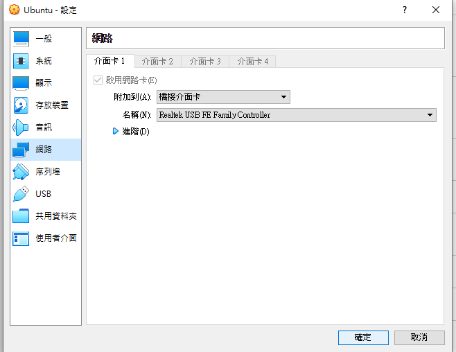

## 實作步驟
- Step-1(查本機IP)

```
ifconfig
```
把IP和介面卡代號記下來，後面設定都會用到。

```
enp0s3 即介面卡的名稱、inet 即 IP  
```
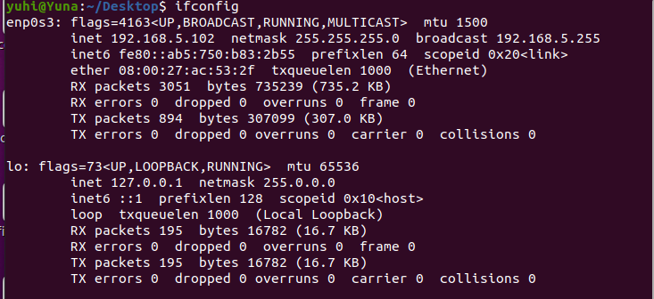


- Step-2(安裝pptp)

```
sudo apt-get install pptpd
```
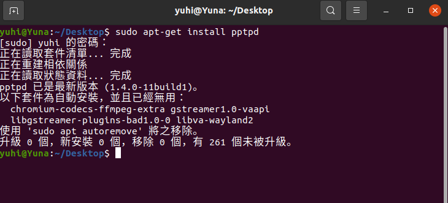


- Step-3(更改pptd.conf裡的loaclip 和 remoteip)

```
sudo nano /etc/pptpd.conf
```

在此設定檔中，需要修改的項目只有設定檔路徑、紀錄檔功能是否啟用、本地端（指VPN伺服器本身）使用的IP位址，以及VPN客戶端連線後可以使用的IP位址。當VPN客戶端連線成功後，VPN伺服器會依照設定從此範圍的IP位址中指派一個IP給對方。

「localip」指定了VPN伺服器所使用的IP位址，一般只要指定正確的位址，便不會有任何的錯誤發生。

「remoteip」則是指定客戶端連線可以使用的IP位址範圍，可用「remoteip 192.168.6.75-85」這種格式加以指定，表示192.168.6.75到192.168.6.255這180個IP位址，都可以指派成為客戶端連線時所使用的IP位址。

只要此範圍內的所有IP位址與本地網路中已被使用的位址沒有衝突，就能作為客戶端可以使用的IP位址範圍。此處指派的位址都是私有位址（Private IP Address），因為大多數的內部網路會使用私有位址。

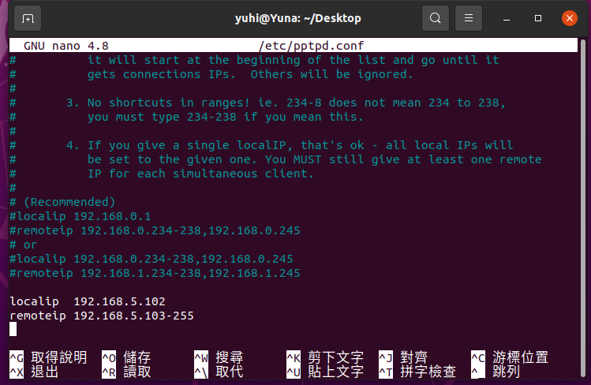


- Step-4(修改pptpd-options)

```
sudo nano /etc/ppp/pptpd-options
```
在「/etc/ppp/pptpd-options」設定檔中，只須注意「name」與「ms-dns」兩個設定項目。「name」欄位表示此VPN伺服器所使用的名稱，直接使用預設值「pptpd」，或是自行指定新名稱皆可。
要注意的是，此名稱稍後在「/etc/ppp/chap-secrets」設定檔中會被使用，因此務必指定正確的名稱才能成功完成VPN連線。

如果客戶端使用的是Windows版本的VPN連接程式，可以由VPN伺服器決定該連線所須使用的DNS伺服器位址。此時只須指定此設定檔中的「ms-dns」欄位，並在後方加上正確的DNS伺服器位址即可。
「ms-dns」欄位可以同時設定二組，第一組會被設定為Windows客戶端的主要DNS伺服器，第二組則是次要DNS伺服器。但此欄位最多只能設定二組，超過二組的部分將不會被使用!

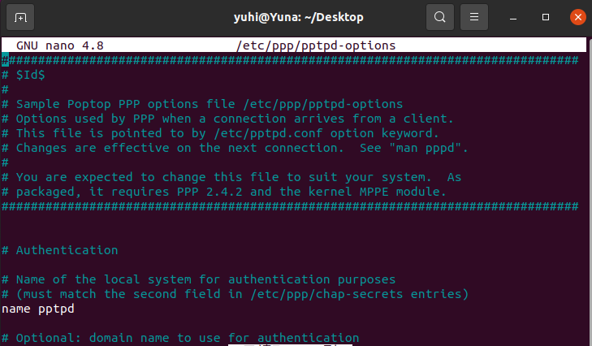

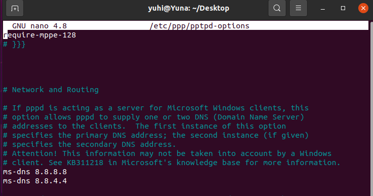


-Step-5(新增使用者)

```
sudo nano /etc/ppp/chap-secrets
```
「/etc/ppp/chap-secrets」便是用來設定VPN使用者帳號與密碼的檔案，接下來使用編輯器開啟此檔案進行設定。此設定檔每一行代表一個帳號的設定，各有四個欄位，並以空白鍵區隔。此四個欄位由左至右的名稱與定義如下：

Client：使用者帳號，可以指定任意字串，例如「user」。

Server：此VPN伺服器的名稱，也就是「/etc/ppp/pptpd-options」檔案中的「name」欄位所指定的設定值，預設為「pptpd」。如果剛才有修改「name」欄位的設定，則需要在此處指定相同的名。

Secret：此欄位即使用者登入時所使用的密碼。例如此欄位設定為「password」，便表示使用者要輸入「password」字串作為密碼，才可以成功登入VPN伺服器。IP Address：此帳號登入後，VPN伺服器所指派的IP位址。
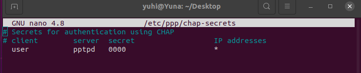


-Step-6(設定本機DNS)
```
開啟網路設定
```
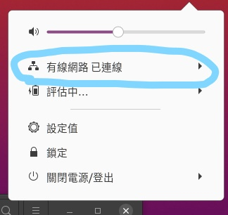


```
設定ipv4的DNS
```
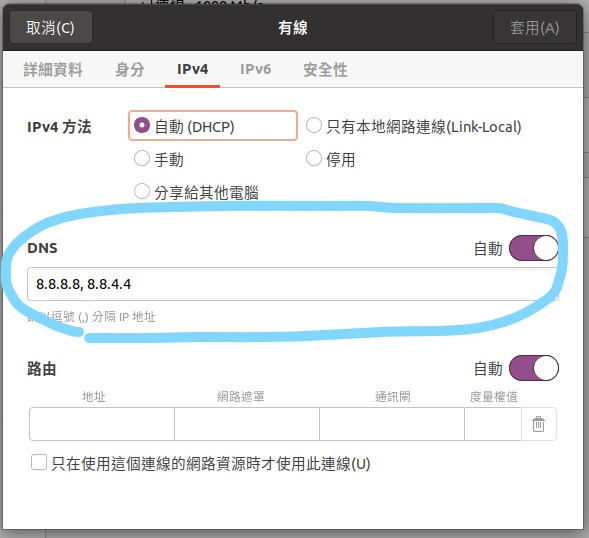


-Step-7(設定防火牆)

```
sudo iptables -t nat -A POSTROUTING -s 192.168.5.0/24 -o enp0s3 -j MASQUERADE
```
系統可能執行防火牆，因此會阻擋外部來的VPN連線要求，所以要輸入下列防火牆指令，以便讓來自VPN客戶端的封包，可以經由VPN伺服器轉送出去。

補充:這裡的IP就是先前你本機的IP只是在最後的號碼變成0，舉例我原本設定的IP是 192.168.5.102，只要把102拿掉換成0，就像 192.168.5.0這樣，這CODE只需把這邊和我前導說過要記得的網路介面卡名稱改成你自己的，這樣就可以了。


-Step-8(重啟pptp)

```
sudo /etc/init.d/pptpd restart

```
以上步驟都完成後，就可以來驗收一下是否有成功架好VPN。

## 功能驗收

-Step-1(再製一台虛擬機)
```
點選 "再製"
```
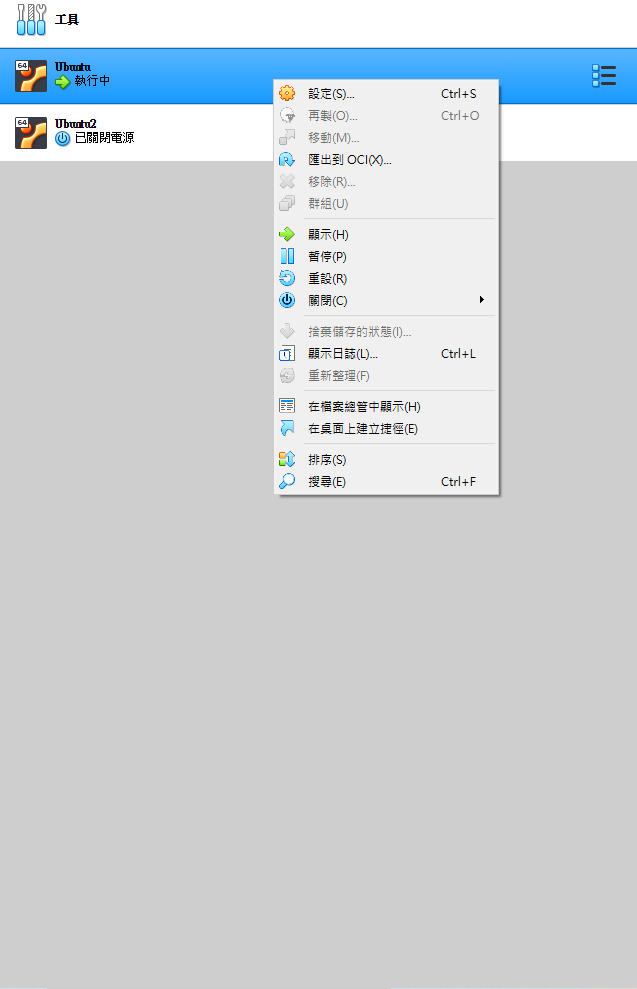
再製完記得要去把網卡改成 "橋接介面卡"

-Step-3(把Sever端即裝有pptp的ubuntu打開)
打開Server端的終端機輸入

```
sudo /etc/init.d/pptpd start
```
這是把pptp打開，必經剛剛關掉整台ubuntu
```
sudo iptables -t nat -A POSTROUTING -s 192.168.5.0/24 -o enp0s3 -j MASQUERADE
```
因為每次ubuntu關機後，防火牆設定會被重新設定，所以我們重開機會還要再輸入一次，這裡的code跟先前防火牆設定一樣

-Step-2(設定VPN連線)
切換到 client 端的 ubuntu，我們來新增一個 VPN連線

```
新增一個VPN
```
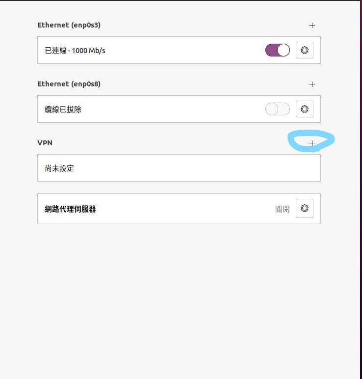

```
名稱:隨意 、 通訊閘: 即先前pptp的 localip 、 使用者名稱: 即先前 pptp設定的 "client"
```

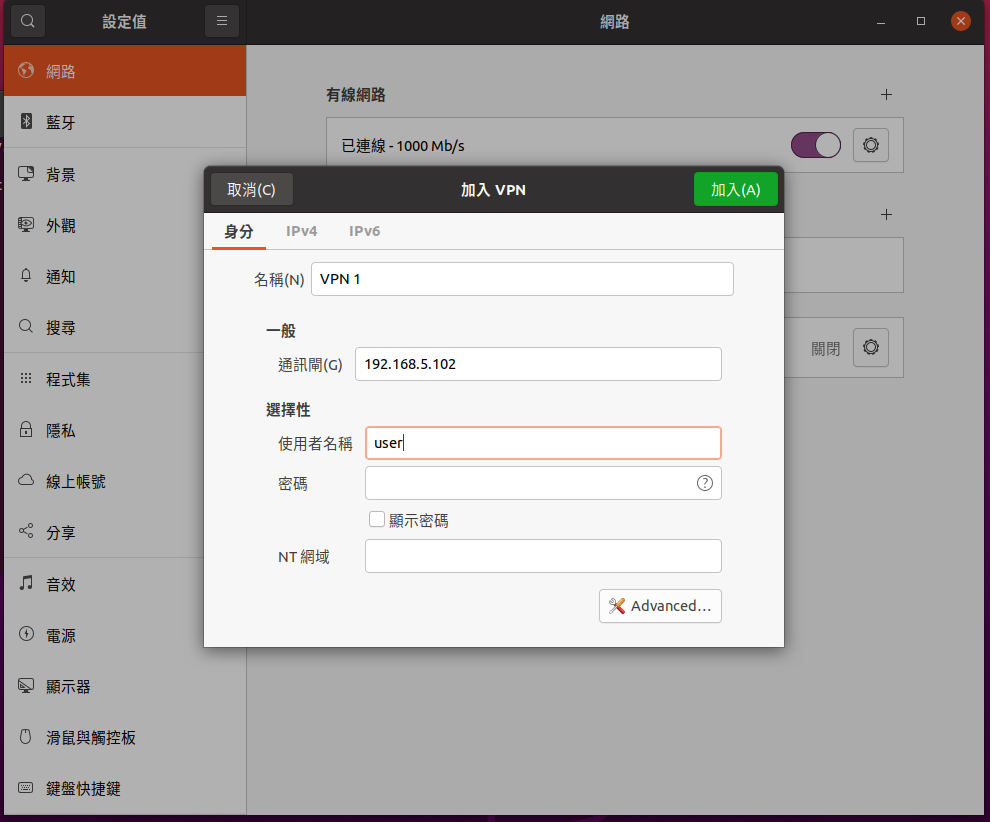

```
點選 "Advanced"，並勾選 "使用點對點加密[MPPE](P)"
```
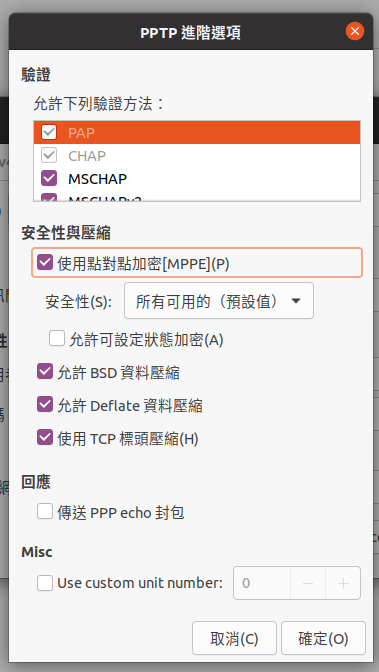
以上步驟完成就有一個VPN了
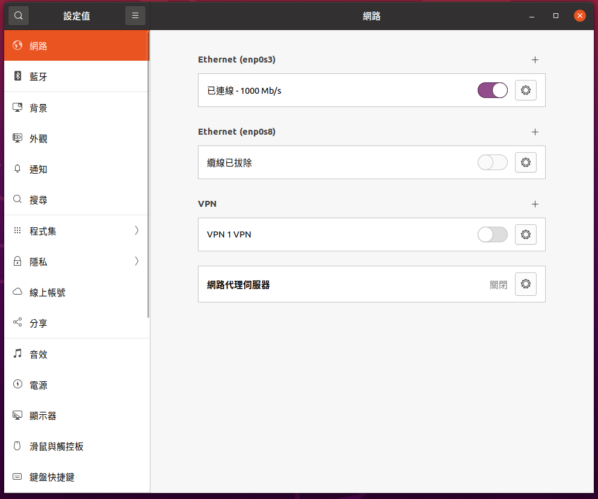

-Step3(將VPN開啟)

```
點開VPN，密碼即是先前PPTP設置的 "secret" 
```
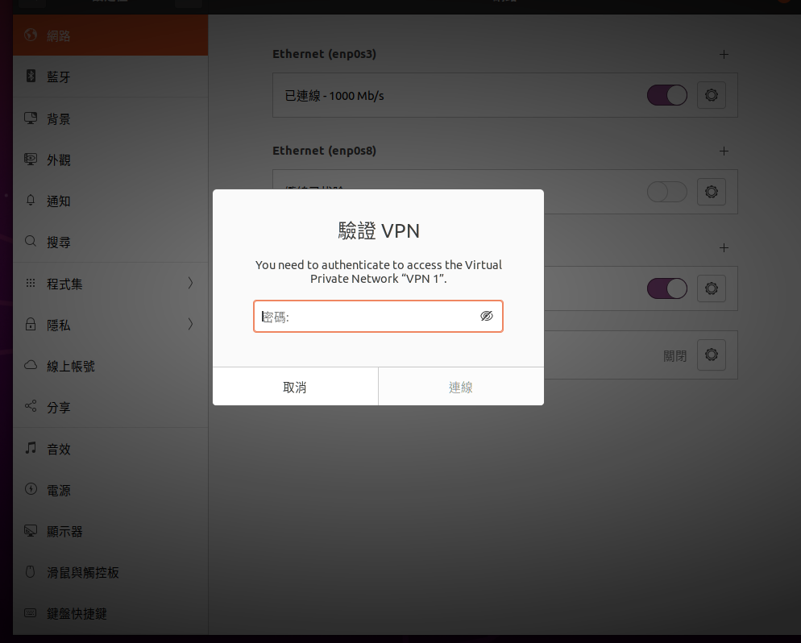

-Step5(最後驗收)
```
ipconfig
```
分別在Server端和Client端的終端機輸入ifconfig，如果有顯示和我圖中一樣

Server端有PPP0 ，並且可以在裡面看到 destination，這就是Server端分配出去的IP

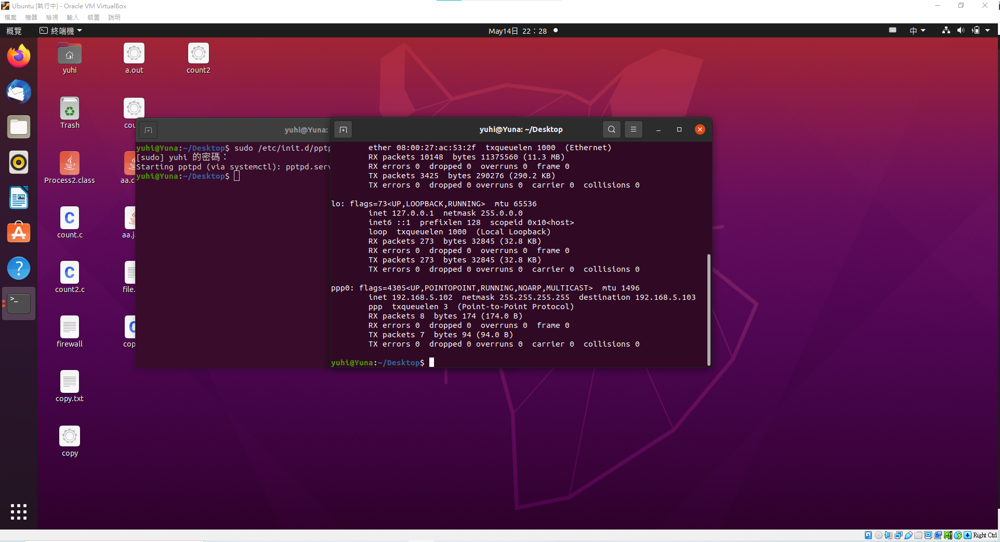


Client端也有PPP0，cleint端的IP 即是 Server端分配的IP，也可以在 destination看到Server端的IP

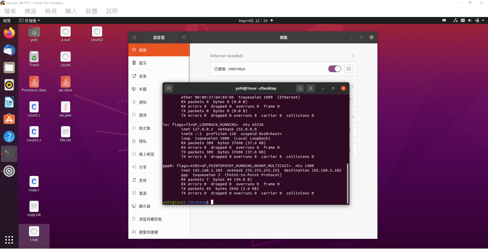

