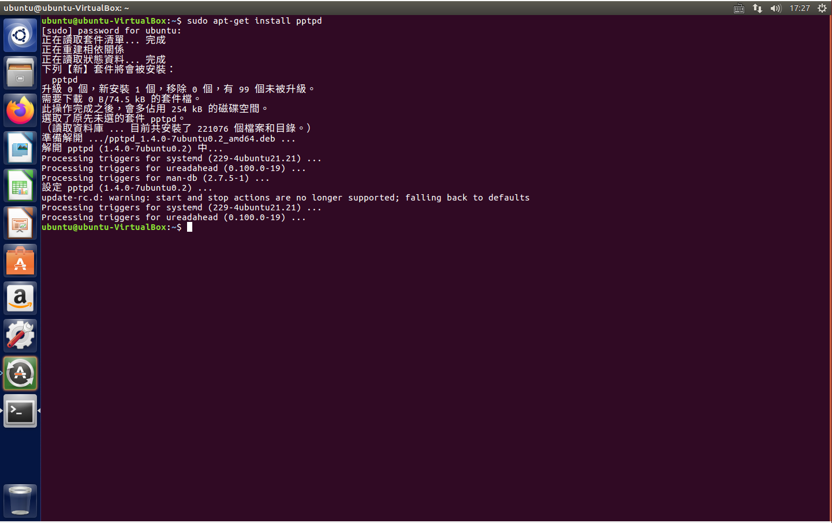
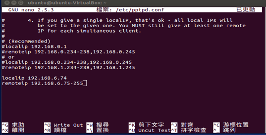

# VPN架設-PPTP

<!-- vim-markdown-toc GFM -->
* [什麼是VPN](#什麼是vpn)
* [什麼是PPTP](#什麼是pptp)
* [實作步驟](#實作步驟)

<!-- vim-markdown-toc -->

## 什麼是VPN
虛擬私人網路，又稱為虛擬專用網路（英文︰Virtual Private Network，簡稱VPN），是一種常用於連接中、大型企業或團體與團體間的私人網路的通訊方法。虛擬私人網路的訊息透過公用的網路架構（例如：網際網路）來傳送內聯網的網路訊息。虛擬私人網路利用已加密的通道協議（Tunneling Protocol）來達到保密、傳送端認證、訊息準確性等私人訊息安全效果。若使用得法，這種技術可以用不安全的網路（例如：網際網路）來傳送可靠、安全的訊息。需要注意的是，加密訊息與否是可以控制的。沒有加密的虛擬私人網路訊息依然有被竊取的危險。

## 什麼是PPTP
點對點隧道協議（PPTP，Point to Point Tunneling Protocol）是一種主要用於VPN的傳輸層網路協議。PPTP的協定規範本身並未描述加密或身份驗證的特性，然而常見的如Microsoft Windows帶有的實現都具備這些。PPTP以GRE（Generic Routing Encapsulation）協定向對方作一般的點對點傳輸。通過TCP1723埠來發起和管理GRE狀態。因為PPTP需要2個網路狀態，因此會對穿越防火牆造成困難。很多防火牆不能完整地傳遞連線，導致無法連接。這經常發生在Windows或Mac OSPPTP可配合MSCHAP-v2或EAP-TLS進行身份驗證 。使用VPN可配合微軟點對點加密〈MPPE〉進行連接時的加密。

## 實作步驟
- Step-1(安裝pptp)

```
sudo apt-get install pptpd
```


- Step-2(更改pptd.conf裡的loaclip 和 remoteip)

```
sudo nano /etc/pptpd.conf
```

在此設定檔中，需要修改的項目只有設定檔路徑、紀錄檔功能是否啟用、本地端（指VPN伺服器本身）使用的IP位址，以及VPN客戶端連線後可以使用的IP位址。當VPN客戶端連線成功後，VPN伺服器會依照設定從此範圍的IP位址中指派一個IP給對方。

「localip」指定了VPN伺服器所使用的IP位址，一般只要指定正確的位址，便不會有任何的錯誤發生。「remoteip」則是指定客戶端連線可以使用的IP位址範圍，可用「remoteip 192.168.6.75-85」這種格式加以指定，表示192.168.6.75到192.168.6.255這180個IP位址，都可以指派成為客戶端連線時所使用的IP位址。

只要此範圍內的所有IP位址與本地網路中已被使用的位址沒有衝突，就能作為客戶端可以使用的IP位址範圍。此處指派的位址都是私有位址（Private IP Address），因為大多數的內部網路會使用私有位址。



- Step-3(修改pptpd-options)

```
sudo nano /etc/ppp/pptpd-options
```
在「/etc/ppp/pptpd-options」設定檔中，只須注意「name」與「ms-dns」兩個設定項目。「name」欄位表示此VPN伺服器所使用的名稱，直接使用預設值「pptpd」，或是自行指定新名稱皆可。
要注意的是，此名稱稍後在「/etc/ppp/chap-secrets」設定檔中會被使用，因此務必指定正確的名稱才能成功完成VPN連線。

如果客戶端使用的是Windows版本的VPN連接程式，可以由VPN伺服器決定該連線所須使用的DNS伺服器位址。此時只須指定此設定檔中的「ms-dns」欄位，並在後方加上正確的DNS伺服器位址即可。
「ms-dns」欄位可以同時設定二組，第一組會被設定為Windows客戶端的主要DNS伺服器，第二組則是次要DNS伺服器。但此欄位最多只能設定二組，超過二組的部分將不會被使用!

![

